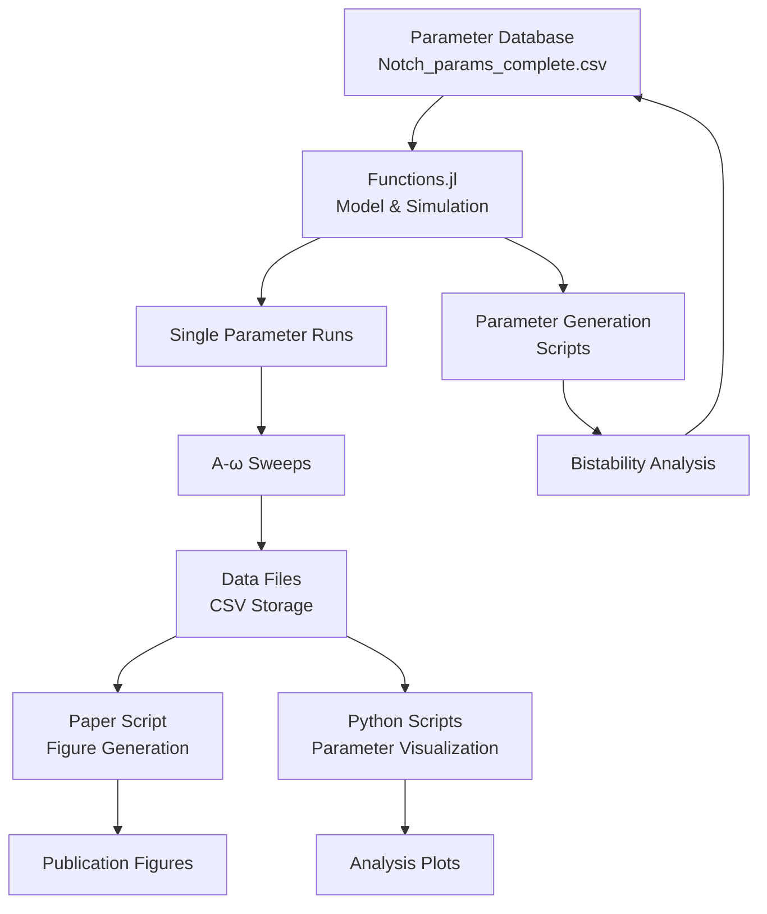

# Comprehensive Documentation - Notch EMT Project

**Last Updated**: August 2024  
**Version**: Post-reorganization

## Table of Contents
1. [Project Overview](#project-overview)
2. [Architecture & Design](#architecture--design)
3. [Directory Structure](#directory-structure)
4. [Core Components](#core-components)
5. [Data Flow](#data-flow)
6. [Key Algorithms](#key-algorithms)
7. [Paper Reproduction](#paper-reproduction)
8. [Development Workflow](#development-workflow)
9. [Technical Details](#technical-details)
10. [Future Development](#future-development)

---

## Project Overview

### Purpose
This project implements a computational framework for investigating Notch signaling dynamics in Epithelial-Mesenchymal Transition (EMT). It explores how pulsatile vs. sustained Notch signaling affects cell fate decisions through epigenetic modifications.

### Key Scientific Questions
1. How does pulsatile Notch signaling differ from sustained signaling in controlling EMT?
2. What is the relationship between signal amplitude (A) and frequency (ω) in determining cell fate?
3. How does PRC2 (Polycomb Repressive Complex 2) rate affect the switching dynamics?

### Main Contributions
- Mathematical model of Notch-EMT coupling with histone modifications
- Parameter sweep analysis revealing A-ω switching boundaries
- Discovery that pulsatile signaling requires higher amplitude for EMT induction
- Framework for analyzing frequency-dependent cell fate control

---

## Architecture & Design

### Technology Stack
- **Language**: Julia 1.10+
- **Key Packages**:
  - Catalyst.jl - Chemical reaction network modeling
  - DifferentialEquations.jl - ODE solving
  - Plots.jl (PyPlot backend) - Visualization
  - DataFrames.jl - Data manipulation
  - CSV.jl - Data I/O
- **Python Components**:
  - Parameter visualization (matplotlib, seaborn, pandas)
  - PyPlot backend support

### Design Principles
1. **Modular Structure**: Core functions separated from analysis scripts
2. **Data Persistence**: Pre-computed results stored for reproducibility
3. **Parameter Database**: External database of biologically relevant parameters
4. **Reproducible Research**: Paper figures can be regenerated exactly

---

## Directory Structure

```
Notch_EMT/
├── src/                              # Core source code
│   ├── Functions.jl                  # Core simulation and analysis functions
│   ├── Notch_EMT_paper.jl           # Paper figure generation (main script)
│   ├── main4_postive_discrete_pulse.jl  # Additional pulse analysis
│   └── archive/                      # Historical development versions
│
├── parameter_generation/             # Parameter space exploration
│   ├── Notch_param_space_size.jl    # Parameter space sizing
│   ├── Notch_param_run_bg.jl        # Background parameter runs
│   ├── Search_params.jl             # Parameter search utilities
│   └── Project.toml                 # Separate environment for generation
│
├── Data/                            # All data files (git-ignored)
│   ├── parameter_databases/         # Parameter sets and bistability analysis
│   │   ├── Notch_core_bistability_db.csv    # 868,649 parameter combinations
│   │   ├── db.csv                           # Selected parameters
│   │   └── db_complete.csv                  # Complete parameter database
│   │
│   ├── precomputed/                # Pre-computed analysis results
│   │   ├── df_592_3d.csv           # PRC2 sweep data for Figure 5
│   │   ├── df_49_592.csv           # Combined analysis results
│   │   └── initial_condition.csv   # Standard initial conditions
│   │
│   └── regular/                    # Simulation outputs by parameter ID
│       └── db_idx:*/               # Results for each parameter set
│
├── figures/                         # Generated figures (git-ignored)
│   ├── paper/                      # Publication figures
│   │   ├── figure3_*.png          # Sustained vs pulsatile comparison
│   │   ├── figure4_*.png          # A-ω boundary analysis
│   │   └── figure5_*.png          # PRC2 rate effects
│   │
│   └── parameter_analysis/         # Parameter space visualizations
│
├── tests/                          # Verification scripts
│   ├── test_paper_script.jl       # Full functionality tests
│   ├── test_data_access.jl        # Data availability checks
│   └── test_paper_generation.jl   # Figure generation tests
│
├── docs/                           # Documentation
│   ├── COMPREHENSIVE_DOCUMENTATION.md  # This file
│   ├── PROJECT_STRUCTURE.md          # Directory layout
│   ├── SETUP.md                       # Installation guide
│   └── reorganization/                # Reorganization history
│
├── examples/notebooks/             # Jupyter notebooks
│   ├── Models.ipynb               # Model exploration
│   └── A_w_curve.ipynb           # A-ω relationship analysis
│
├── models/legacy/                  # Previous model versions
│
├── utils/                         # Utility functions
│
├── visualization/                 # Python visualization scripts
│   └── parameter_analysis.py     # Parameter space analysis
│
├── Project.toml                  # Julia project dependencies
├── Manifest.toml                 # Exact dependency versions
├── README.md                     # Project introduction
├── CLAUDE.md                     # AI assistant notes
└── .gitignore                    # Excludes Data/, figures/, .venv/
```

---

## Core Components

### 1. Model Definition (`Functions.jl`)

#### Key Functions:
- **`Import_model()`**: Creates the Catalyst.jl reaction network
  - 18 species: Notch components, transcription factors, histones
  - 40+ reactions: binding, transcription, modification
  - Parameters: rates, binding constants, Hill coefficients

- **`single_solve()`**: Performs single parameter simulation
  ```julia
  single_solve(prob, db_idx; freq, amplitude, ΔT, phase, T, callback)
  ```
  - Handles both sustained and pulsatile signals
  - Implements discrete pulse callbacks
  - Returns time series and classification

- **`loading_database()`**: Loads parameter sets
  ```julia
  data = loading_database("../Notch_EMT_data/Notch_params_complete.csv")
  ```
  - Reads from external parameter database
  - Returns DataFrame with ~1000 parameter sets

- **`A_ω_st_relation()`**: Parameter sweep for A-ω analysis
  ```julia
  A_ω_st_relation(model, data, db_idx; amplitude_range, freq_range, ΔT)
  ```
  - Sweeps amplitude and frequency space
  - Classifies switching behavior
  - Returns DataFrame with results

### 2. Paper Figure Generation (`Notch_EMT_paper.jl`)

#### Main Functions:
- **`generate_figure3()`**: Sustained vs Pulsatile Dynamics
  - Panel A: Sustained Dll4 signaling time series
  - Panel B: Pulsatile signaling with different frequencies
  - Shows EMT marker (Snail1) and epithelial marker (EPCAM) dynamics

- **`generate_figure4()`**: A-ω Switching Boundary
  - Panel A: Heatmap of switching behavior in A-ω space
  - Panel B: Switching time vs frequency plot
  - Uses parameter set db_idx=49 with ΔT=150

- **`generate_figure5()`**: PRC2 Rate Effects
  - 3D surface plot: A-ω boundary for different PRC2 rates
  - Shows how epigenetic regulation affects switching
  - Pre-computed data: 592 parameter sets × 10 PRC2 rates

- **`check_critical_amplitude_custom()`**: Find minimum amplitude
  ```julia
  A_crit = check_critical_amplitude_custom(prob, freq, ΔT; tol=1e-5)
  ```
  - Binary search for critical amplitude
  - Used for boundary detection

### 3. Parameter Generation Scripts

- **`Notch_param_space_size.jl`**: 
  - Generates parameter combinations
  - Tests for bistability
  - Creates parameter database

- **`Search_params.jl`**:
  - Searches for specific dynamic behaviors
  - Filters parameters by stability properties

---

## Data Flow



### Data Pipeline:
1. **Parameter Loading**: External database → DataFrame
2. **Simulation**: ODEs solved for each parameter/condition
3. **Classification**: Time series → switching behavior
4. **Aggregation**: Results collected in DataFrames
5. **Visualization**: Plots generated from aggregated data
6. **Storage**: Results saved as CSV for reproducibility

---

## Key Algorithms

### 1. Bistability Detection
```julia
# Check if system has two stable states
function check_bistability(model, params)
    # Start from epithelial state
    sol_epi = solve(prob, init_epi)
    # Start from mesenchymal state  
    sol_mes = solve(prob, init_mes)
    # Compare steady states
    return !isapprox(sol_epi[end], sol_mes[end])
end
```

### 2. Switching Classification
```julia
function classify_response(timeseries, species_idx)
    initial = timeseries[1, species_idx]
    final = timeseries[end, species_idx]
    threshold = (max_val + min_val) / 2
    
    if initial < threshold && final > threshold
        return "E→M"  # Epithelial to Mesenchymal
    elseif initial > threshold && final < threshold
        return "M→E"  # Mesenchymal to Epithelial
    else
        return "No switch"
    end
end
```

### 3. Critical Amplitude Search
```julia
function find_critical_amplitude(freq, ΔT)
    low, high = 0.0, 300.0
    while high - low > tolerance
        mid = (low + high) / 2
        if switches_at_amplitude(mid, freq, ΔT)
            high = mid
        else
            low = mid
        end
    end
    return (low + high) / 2
end
```

### 4. Discrete Pulse Implementation
```julia
# Callback for pulsatile signaling
function pulse_callback(t, phase, ΔT, freq, amplitude)
    t_shift = t - phase / (2π * freq)
    period = 1 / freq
    in_pulse = (t_shift % period) < (ΔT / 3600)
    return in_pulse ? amplitude : 0.0
end
```

---

## Paper Reproduction

### Prerequisites
1. Julia 1.10+ with required packages
2. Parameter database at `../Notch_EMT_data/`
3. ~4GB RAM for full analysis
4. Python with matplotlib for PyPlot backend

### Generating All Figures
```bash
cd /path/to/Notch_EMT
julia --project=. src/Notch_EMT_paper.jl
```

### Individual Figures
```julia
include("src/Notch_EMT_paper.jl")
generate_figure3()  # Takes ~2 minutes
generate_figure4()  # Takes ~5 minutes (or instant with pre-computed data)
generate_figure5()  # Takes ~10 hours (or instant with pre-computed data)
```

### Expected Outputs
- 8 PNG files in `figures/paper/`
- Resolution: 300 DPI
- Size: ~200-500KB each
- Format: Publication-ready with LaTeX labels

### Verification
```bash
julia --project=. tests/test_paper_script.jl
```

---

## Development Workflow

### 1. Setting Up Development Environment
```bash
git clone <repository>
cd Notch_EMT
julia --project=.
] instantiate  # Install dependencies
```

### 2. Running Simulations
```julia
using Revise
includet("src/Functions.jl")

# Load model and parameters
model, init = Import_model()
data = loading_database()

# Run single simulation
result = single_solve(prob, 49; freq=0.5, amplitude=100)
```

### 3. Parameter Exploration
```julia
# Sweep parameter space
df = A_ω_st_relation(model, data, 49; 
    amplitude_range=0:10:300,
    freq_range=0:0.1:2.0,
    ΔT=150
)
```

### 4. Adding New Analysis
1. Implement function in `Functions.jl`
2. Create test in `tests/`
3. Add visualization in paper script
4. Update documentation

### 5. Git Workflow
```bash
git checkout -b feature/new-analysis
# Make changes
julia --project=. tests/test_paper_script.jl  # Verify
git add -A
git commit -m "Add new analysis feature"
```

---

## Technical Details

### Model Specifications
- **ODEs**: 18 coupled differential equations
- **Solver**: AutoTsit5(Rosenbrock23()) or Rodas5P()
- **Tolerance**: abstol=1e-10, reltol=1e-8
- **Time**: Hours (typical simulation: 0-250 hours)

### Performance Considerations
- Single simulation: ~0.5-2 seconds
- Full A-ω sweep (30×20 grid): ~5-10 minutes
- PRC2 sweep (10 values): ~10 hours without parallelization
- Memory: ~500MB for typical analysis

### Parallelization
```julia
using Distributed
addprocs(4)  # Add 4 worker processes
@everywhere includet("src/Functions.jl")

# Parallel parameter sweep
results = pmap(params) do p
    single_solve(prob, p.db_idx; freq=p.freq, amplitude=p.amp)
end
```

### Data Storage Format
CSV files with columns:
- `amplitude`: Signal amplitude (AU)
- `freq`: Signal frequency (1/hour)
- `switch_time`: Time to switch (hours)
- `switch`: Classification (E→M, No switch, etc.)
- `prc2`: PRC2 rate multiplier
- `idx`: Parameter set ID

---

## Future Development

### Planned Enhancements
1. **GPU Acceleration**: For large parameter sweeps
2. **Interactive Visualizations**: Dash/PlotlyJS dashboards
3. **Sensitivity Analysis**: Global parameter sensitivity
4. **Stochastic Extensions**: Add noise to signaling
5. **Spatial Modeling**: 2D/3D tissue simulations

### Research Directions
1. **Mixed Signaling**: Combinations of sustained/pulsatile
2. **Multiple Ligands**: Dll4 + Jag1 interactions
3. **Cell-Cell Communication**: Lateral inhibition
4. **Drug Targeting**: Identify intervention points
5. **Patient Data**: Connect to expression profiles

### Code Improvements
1. **Type Stability**: Optimize inner loops
2. **Precompilation**: Reduce startup time
3. **Testing**: Increase coverage to >90%
4. **Documentation**: Add more examples
5. **CI/CD**: Automated testing pipeline

---

## Appendices

### A. Parameter Descriptions
See `CLAUDE.md` for detailed parameter tables

### B. File Formats
See `docs/PROJECT_STRUCTURE.md` for file specifications

### C. Troubleshooting
See `docs/SETUP.md` for common issues

### D. Contributing
1. Fork repository
2. Create feature branch
3. Add tests
4. Submit pull request

---

*This documentation reflects the state of the project after the August 2024 reorganization.*